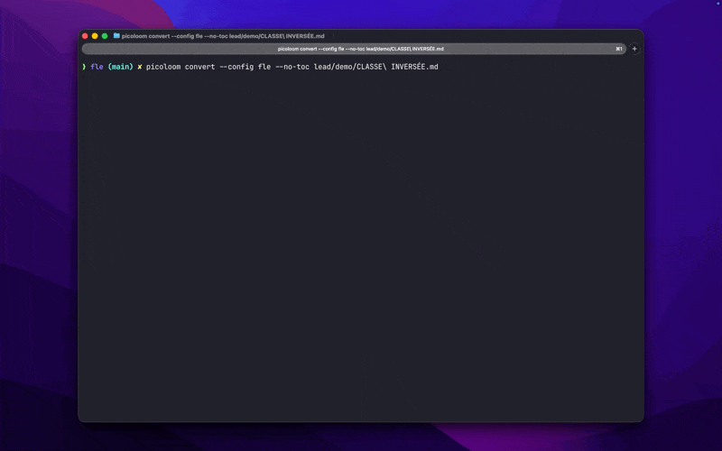

# Picoloom

[](https://pkg.go.dev/github.com/alnah/picoloom/v2)
[](https://goreportcard.com/report/github.com/alnah/picoloom/v2)
[](https://github.com/alnah/picoloom/actions)
[](https://codecov.io/gh/alnah/picoloom)
[](LICENSE)

> If you need something between the complexity of Pandoc and the speed of Markdown-to-PDF converters with limited styling options, Picoloom might be a good fit. It is a small, opinionated Go library and CLI for converting Markdown to PDF that I created to share teaching materials with my French students. I designed it to be easy enough, fast enough, and polished enough for that purpose. It supports cover pages, tables of contents, watermarks, signatures, and more. You can also use CSS themes and custom assets. It supports parallel batch processing. Under the hood, it uses Chrome, and it does not rely on LaTeX. I hope it will be useful to you as well.

[See example outputs](examples/)



## Table of Contents

- [Installation](#installation)
- [Quick Start](#quick-start)
- [Features](#features)
- [CLI Reference](#cli-reference)
- [Environment Variables](#environment-variables)
- [Configuration](#configuration)
- [Config Init Wizard](#config-init-wizard)
- [Library Usage](#library-usage)
- [Troubleshooting](#troubleshooting)
- [Known Limitations](#known-limitations)
- [Contributing](#contributing)

## Installation

```bash
go install github.com/alnah/picoloom/v2/cmd/picoloom@v2
```

The current Go module path is `github.com/alnah/picoloom/v2`.

For reproducible CI or pinned installs, use an exact version:

```bash
go install github.com/alnah/picoloom/v2/cmd/picoloom@v2.1.2
```

Using `@v2` avoids the extra legacy v1 module lookup/downloading noise that can happen with `@latest` on versioned Go modules.

<details>
<summary>Other installation methods</summary>

### Homebrew

```bash
brew tap alnah/tap
brew install alnah/tap/picoloom
```

Update later with:

```bash
brew upgrade alnah/tap/picoloom
```

On a fresh machine without Chrome installed yet, `picoloom doctor` stays strict by
default. Use `picoloom doctor --allow-managed-browser` to validate the managed
Chromium bootstrap path used on first run.

### Docker

```bash
docker pull ghcr.io/alnah/picoloom:latest
```

### Binary Download

Download pre-built binaries from [GitHub Releases](https://github.com/alnah/picoloom/releases).

</details>

## Requirements

- Go 1.25+
- Chrome/Chromium (downloaded automatically on first run)
- Homebrew users can install the CLI from `alnah/tap/picoloom`

> **Docker/CI users:** See [Troubleshooting](#troubleshooting) for setup instructions.

## Quick Start

### CLI

```bash
picoloom convert document.md                # Single file
picoloom convert ./docs/ -o ./output/       # Batch convert
picoloom convert -c work document.md        # With config
picoloom config init                        # Create config with wizard
```

### Library

```go
package main

import (
    "context"
    "log"
    "os"

    "github.com/alnah/picoloom/v2"
)

func main() {
    conv, err := picoloom.NewConverter()
    if err != nil {
        log.Fatal(err)
    }
    defer conv.Close()

    result, err := conv.Convert(context.Background(), picoloom.Input{
        Markdown: "# Hello World\n\nGenerated with Picoloom.",
    })
    if err != nil {
        log.Fatal(err)
    }

    os.WriteFile("output.pdf", result.PDF, 0644)
}
```

The `Convert()` method returns a `ConvertResult` containing:
- `result.PDF` - the generated PDF bytes
- `result.HTML` - the intermediate HTML (useful for debugging)

Use `Input.HTMLOnly: true` to skip PDF generation and only produce HTML.

## Features

- **CLI + Library** - Use as `picoloom` command or import in Go, with shell completion
- **Batch conversion** - Process directories with parallel workers
- **Cover pages** - Title, subtitle, logo, author, organization, date, version
- **Table of contents** - Auto-generated from headings with configurable depth
- **Frontmatter stripping** - YAML frontmatter (`---` blocks) stripped before conversion
- **Custom styling** - Embedded themes or your own CSS ([some limitations](#known-limitations))
- **Page settings** - Size (letter, A4, legal), orientation, margins
- **Signatures** - Name, title, email, photo, links
- **Footers** - Page numbers, dates, status text
- **Watermarks** - Diagonal background text (BRAND, etc.)

## CLI Reference

```bash
picoloom convert document.md                # Single file
picoloom convert ./docs/ -o ./output/       # Batch convert
picoloom convert -c work document.md        # With config
picoloom convert --style technical doc.md   # With style
picoloom config init                        # Interactive config wizard
```

<details>
<summary>All flags</summary>

```
picoloom <command> [flags] [args]

Commands:
  convert      Convert markdown files to PDF
  config       Manage configuration files
  doctor       Check system configuration
  completion   Generate shell completion script
  version      Show version information
  help         Show help for a command

picoloom convert <input> [flags]

Input/Output:
  -o, --output <path>       Output file or directory
  -c, --config <name>       Config file name or path
  -w, --workers <n>         Parallel workers (0 = auto)
  -t, --timeout <duration>  PDF generation timeout (default: 30s)
                            Examples: 30s, 2m, 1m30s

Author:
      --author-name <s>     Author name
      --author-title <s>    Author professional title
      --author-email <s>    Author email
      --author-org <s>      Organization name
      --author-phone <s>    Author phone number
      --author-address <s>  Author postal address
      --author-dept <s>     Author department

Document:
      --doc-title <s>       Document title ("" = auto from H1)
      --doc-subtitle <s>    Document subtitle
      --doc-version <s>     Version string
      --doc-date <s>        Date (see Date Formats section)
      --doc-client <s>      Client name
      --doc-project <s>     Project name
      --doc-type <s>        Document type
      --doc-id <s>          Document ID/reference
      --doc-desc <s>        Document description

Page:
  -p, --page-size <s>       letter, a4, legal (default: letter)
      --orientation <s>     portrait, landscape (default: portrait)
      --margin <f>          Margin in inches (default: 0.5)

Footer:
      --footer-position <s> left, center, right (default: right)
      --footer-text <s>     Custom footer text
      --footer-page-number  Show page numbers
      --footer-doc-id       Show document ID in footer
      --no-footer           Disable footer

Cover:
      --cover-logo <path>   Logo path or URL
      --cover-dept          Show author department on cover
      --no-cover            Disable cover page

Signature:
      --sig-image <path>    Signature image path
      --no-signature        Disable signature block

Table of Contents:
      --toc-title <s>       TOC heading text
      --toc-min-depth <n>   Min heading depth (1-6, default: 2)
                            1=H1, 2=H2, etc. Use 2 to skip title
      --toc-max-depth <n>   Max heading depth (1-6, default: 3)
      --no-toc              Disable table of contents

Watermark:
      --wm-text <s>         Watermark text
      --wm-color <s>        Color hex (default: #888888)
      --wm-opacity <f>      Opacity 0.0-1.0 (default: 0.1)
      --wm-angle <f>        Angle in degrees (default: -45)
      --no-watermark        Disable watermark

Page Breaks:
      --break-before <s>    Break before headings: h1,h2,h3
      --orphans <n>         Min lines at page bottom (default: 2)
      --widows <n>          Min lines at page top (default: 2)
      --no-page-breaks      Disable page break features

Assets & Styling:
      --style <name|path>   CSS style name or file path (default: default)
                            Name: uses embedded or custom asset (e.g., "technical")
                            Path: reads file directly (contains / or \)
      --template <name|path> Template set name or directory path
      --asset-path <dir>    Custom asset directory (overrides config)
      --no-style            Disable CSS styling

Debug Output:
      --html                Output HTML alongside PDF
      --html-only           Output HTML only, skip PDF generation

Output Control:
  -q, --quiet               Only show errors
  -v, --verbose             Show detailed timing

picoloom config init [flags]

Config Init:
      --output <path>       Output path for generated config (default: ./picoloom.yaml)
      --force               Overwrite destination if it exists
      --no-input            Use defaults without interactive prompts
```

</details>

<details>
<summary>Examples</summary>

```bash
# Single file with custom output
picoloom convert -o report.pdf input.md

# Batch with config
picoloom convert -c work ./docs/ -o ./pdfs/

# Custom CSS, no footer
picoloom convert --style ./custom.css --no-footer document.md

# A4 landscape with 1-inch margins
picoloom convert -p a4 --orientation landscape --margin 1.0 document.md

# With watermark
picoloom convert --wm-text "DRAFT" --wm-opacity 0.15 document.md

# Override document title
picoloom convert --doc-title "Final Report" document.md

# Page breaks before H1 and H2 headings
picoloom convert --break-before h1,h2 document.md

# Use embedded style by name
picoloom convert --style technical document.md

# Debug: output HTML alongside PDF
picoloom convert --html document.md

# Debug: output HTML only (no PDF)
picoloom convert --html-only document.md

# Use custom assets directory
picoloom convert --asset-path ./my-assets document.md

# Interactive config wizard
picoloom config init

# Non-interactive config generation (CI/scripts)
picoloom config init --no-input --output ./configs/work.yaml --force
```

</details>

<details>
<summary>Shell Completion</summary>

Generate shell completion scripts for tab-completion of commands, flags, and file arguments:

```bash
# Bash - add to ~/.bashrc
eval "$(picoloom completion bash)"

# Zsh - add to ~/.zshrc
eval "$(picoloom completion zsh)"

# Fish - save to completions directory
picoloom completion fish > ~/.config/fish/completions/picoloom.fish

# PowerShell - add to $PROFILE
picoloom completion powershell | Out-String | Invoke-Expression
```

</details>

<details>
<summary>Exit Codes</summary>

| Code | Name | Description |
|------|------|-------------|
| 0 | Success | Conversion completed successfully |
| 1 | General | Unexpected or unclassified error |
| 2 | Usage | Invalid flags, configuration, or validation failure |
| 3 | I/O | File not found, permission denied, write failure |
| 4 | Browser | Chrome not found, connection failed, timeout |

Example usage in scripts:

```bash
picoloom convert document.md
case $? in
    0) echo "Success" ;;
    2) echo "Check your flags or config" ;;
    3) echo "Check file permissions" ;;
    4) echo "Check Chrome installation" ;;
    *) echo "Unknown error" ;;
esac
```

</details>

<details>
<summary>Doctor Command</summary>

Diagnose system configuration before running conversions:

```bash
picoloom doctor           # Human-readable output
picoloom doctor --json    # JSON output for CI/scripts
picoloom doctor --allow-managed-browser
```

Checks performed:
- Chrome/Chromium: binary exists, version, sandbox status
- Environment: container detection (Docker, Podman, Kubernetes)
- System: temp directory writability

Use `--allow-managed-browser` on fresh Homebrew installs when Chromium may be
downloaded on first run instead of being installed locally ahead of time.

Exit codes:
- `0` - All checks passed (including warnings)
- `1` - Errors found (conversion will likely fail)

Example CI usage:

```bash
# Fail pipeline early if setup is broken
picoloom doctor --json | jq -e '.status != "errors"' || exit 1
```

</details>

<details>
<summary>Docker</summary>

```bash
# Convert a single file
docker run --rm -v $(pwd):/data ghcr.io/alnah/picoloom convert document.md

# Convert with output path
docker run --rm -v $(pwd):/data ghcr.io/alnah/picoloom convert -o output.pdf input.md

# Batch convert directory
docker run --rm -v $(pwd):/data ghcr.io/alnah/picoloom convert ./docs/ -o ./pdfs/
```

> **Note:** The official Docker image has all dependencies pre-installed. For custom images, see [Troubleshooting](#troubleshooting).

</details>

## Environment Variables

Environment variables provide CI/CD-friendly configuration without requiring YAML files.

**Priority:** CLI flags > config file > environment variables > defaults

### PICOLOOM Variables

| Variable | Description |
|----------|-------------|
| `PICOLOOM_CONFIG` | Config file path (e.g., `/app/config.yaml`) |
| `PICOLOOM_INPUT_DIR` | Default input directory |
| `PICOLOOM_OUTPUT_DIR` | Default output directory |
| `PICOLOOM_TIMEOUT` | PDF generation timeout (e.g., `2m`, `90s`) |
| `PICOLOOM_STYLE` | CSS style name or path (e.g., `technical`) |
| `PICOLOOM_WORKERS` | Parallel workers (e.g., `4`) |
| `PICOLOOM_AUTHOR_NAME` | Author name for cover/signature |
| `PICOLOOM_AUTHOR_ORG` | Organization name |
| `PICOLOOM_AUTHOR_EMAIL` | Author email |
| `PICOLOOM_DOC_VERSION` | Document version |
| `PICOLOOM_DOC_DATE` | Document date (supports `auto`) |
| `PICOLOOM_DOC_ID` | Document ID |
| `PICOLOOM_PAGE_SIZE` | Page size: `letter`, `a4`, `legal` |
| `PICOLOOM_COVER_LOGO` | Cover logo path/URL (auto-enables cover) |
| `PICOLOOM_WATERMARK_TEXT` | Watermark text (auto-enables watermark) |
| `PICOLOOM_CONTAINER` | Set to `1` to force container detection (for `picoloom doctor`) |

Legacy `MD2PDF_*` variables are still accepted as fallback. Unknown `PICOLOOM_*` or `MD2PDF_*` variables trigger a warning to catch typos.

<details>
<summary>CI/CD Examples</summary>

**GitHub Actions:**
```yaml
- name: Generate PDFs
  env:
    PICOLOOM_STYLE: technical
    PICOLOOM_AUTHOR_ORG: ${{ github.repository_owner }}
    PICOLOOM_DOC_VERSION: ${{ github.ref_name }}
    PICOLOOM_WATERMARK_TEXT: ${{ github.ref_name == 'main' && '' || 'DRAFT' }}
  run: picoloom convert ./docs/ -o ./output/
```

**GitLab CI:**
```yaml
pdf:
  variables:
    PICOLOOM_STYLE: corporate
    PICOLOOM_OUTPUT_DIR: ./artifacts/pdf
    PICOLOOM_DOC_DATE: auto
  script:
    - picoloom convert ./docs/
```

**Docker:**
```bash
docker run --rm \
  -e PICOLOOM_STYLE=technical \
  -e PICOLOOM_AUTHOR_ORG="Acme Corp" \
  -e ROD_NO_SANDBOX=1 \
  -v $(pwd):/data \
  ghcr.io/alnah/picoloom convert ./docs/
```

</details>

### Browser Variables (go-rod)

| Variable | Default | Description |
|----------|---------|-------------|
| `ROD_NO_SANDBOX` | - | Set to `1` to disable Chrome sandbox (required for Docker/CI) |
| `ROD_BROWSER_BIN` | - | Path to custom Chrome/Chromium binary |

These are used by the underlying [go-rod](https://github.com/go-rod/rod) browser automation library. Error messages will suggest these variables when browser issues are detected in CI/Docker environments.

## Configuration

Config files are searched in the current directory first, then in the user config directory:

| OS      | User Config Directory                      |
| ------- | ------------------------------------------ |
| Linux   | `~/.config/picoloom/`                      |
| macOS   | `~/Library/Application Support/picoloom/`  |
| Windows | `%APPDATA%\picoloom\`                      |

Supported formats: `.yaml`, `.yml`

Legacy fallbacks are still supported during the migration: `./md2pdf.yaml`, `~/.config/go-md2pdf/`, and `MD2PDF_*`.

## Config Init Wizard

Use the wizard to generate a valid config file without writing YAML manually:

```bash
# Interactive wizard (TTY required)
picoloom config init

# Custom destination
picoloom config init --output ./configs/work.yaml

# Non-interactive defaults (CI/scripts)
picoloom config init --no-input --output ./configs/work.yaml --force
```

Wizard behavior:
- Prompts are in English and include available options plus an example value.
- Type `?` at a prompt to display inline help and a YAML snippet.
- Interactive mode collects style, author fields, page size, and optional signature/watermark/cover settings.
- Interactive mode shows a summary and YAML preview before write confirmation.
- Without `--force`, existing files are preserved; with `--force`, overwrite is explicit and safe.

| Option                  | Type   | Default      | Description                              |
| ----------------------- | ------ | ------------ | ---------------------------------------- |
| `input.defaultDir`      | string | -            | Default input directory                  |
| `output.defaultDir`     | string | -            | Default output directory                 |
| `timeout`               | string | `"30s"`      | PDF generation timeout (e.g., "30s", "2m") |
| `style`                 | string | `"default"`  | CSS style name or path                   |
| `assets.basePath`       | string | -            | Custom assets directory (styles, templates) |
| `author.name`           | string | -            | Author name (used by cover, signature)   |
| `author.title`          | string | -            | Author professional title                |
| `author.email`          | string | -            | Author email                             |
| `author.organization`   | string | -            | Organization name                        |
| `author.phone`          | string | -            | Contact phone number                     |
| `author.address`        | string | -            | Postal address (multiline via YAML `\|`) |
| `author.department`     | string | -            | Department name                          |
| `document.title`        | string | -            | Document title ("" = auto from H1)       |
| `document.subtitle`     | string | -            | Document subtitle                        |
| `document.version`      | string | -            | Version string (used in cover, footer)   |
| `document.date`         | string | -            | Date (see [Date Formats](#date-formats)) |
| `document.clientName`   | string | -            | Client/customer name                     |
| `document.projectName`  | string | -            | Project name                             |
| `document.documentType` | string | -            | Document type (e.g., "Specification")    |
| `document.documentID`   | string | -            | Document ID (e.g., "DOC-2025-001")       |
| `document.description`  | string | -            | Brief document summary                   |
| `page.size`             | string | `"letter"`   | letter, a4, legal                        |
| `page.orientation`      | string | `"portrait"` | portrait, landscape                      |
| `page.margin`           | float  | `0.5`        | Margin in inches (0.25-3.0)              |
| `cover.enabled`         | bool   | `false`      | Show cover page                          |
| `cover.logo`            | string | -            | Logo path or URL                         |
| `cover.showDepartment`  | bool   | `false`      | Show author.department on cover          |
| `toc.enabled`           | bool   | `false`      | Show table of contents                   |
| `toc.title`             | string | -            | TOC title (empty = no title)             |
| `toc.minDepth`          | int    | `2`          | Min heading depth (1-6, skips H1)        |
| `toc.maxDepth`          | int    | `3`          | Max heading depth (1-6)                  |
| `footer.enabled`        | bool   | `false`      | Show footer                              |
| `footer.showPageNumber` | bool   | `false`      | Show page numbers                        |
| `footer.position`       | string | `"right"`    | left, center, right                      |
| `footer.text`           | string | -            | Custom footer text                       |
| `footer.showDocumentID` | bool   | `false`      | Show document.documentID in footer       |
| `signature.enabled`     | bool   | `false`      | Show signature block                     |
| `signature.imagePath`   | string | -            | Photo path or URL                        |
| `signature.links`       | array  | -            | Links (label, url)                       |
| `watermark.enabled`     | bool   | `false`      | Show watermark                           |
| `watermark.text`        | string | -            | Watermark text (required if enabled)     |
| `watermark.color`       | string | `"#888888"`  | Watermark color (hex)                    |
| `watermark.opacity`     | float  | `0.1`        | Watermark opacity (0.0-1.0)              |
| `watermark.angle`       | float  | `-45`        | Watermark rotation (degrees)             |
| `pageBreaks.enabled`    | bool   | `false`      | Enable page break features               |
| `pageBreaks.beforeH1`   | bool   | `false`      | Page break before H1 headings            |
| `pageBreaks.beforeH2`   | bool   | `false`      | Page break before H2 headings            |
| `pageBreaks.beforeH3`   | bool   | `false`      | Page break before H3 headings            |
| `pageBreaks.orphans`    | int    | `2`          | Min lines at page bottom (1-5)           |
| `pageBreaks.widows`     | int    | `2`          | Min lines at page top (1-5)              |

<details>
<summary>Example config file</summary>

```yaml
# ~/.config/picoloom/work.yaml

# Input/Output directories
input:
  defaultDir: './docs/markdown' # Default input when no arg provided

output:
  defaultDir: './docs/pdf' # Default output when no -o flag

# PDF generation timeout (default: 30s)
# Use Go duration format: 30s, 2m, 1m30s
timeout: '1m'

# Shared author info (used by cover and signature)
author:
  name: 'John Doe'
  title: 'Senior Developer'
  email: 'john@example.com'
  organization: 'Acme Corp'
  phone: '+1 555-0123'
  address: |
    123 Main Street
    San Francisco, CA 94102
  department: 'Engineering'

# Shared document metadata (used by cover and footer)
document:
  title: '' # "" = auto from H1 or filename
  subtitle: 'Internal Document'
  version: 'v1.0'
  # Date formats:
  #   - Literal: '2025-01-11'
  #   - Auto (ISO): 'auto' -> 2025-01-11
  #   - Auto with format: 'auto:DD/MM/YYYY' -> 11/01/2025
  #   - Auto with preset: 'auto:long' -> January 11, 2025
  # Presets: iso, european, us, long
  # Tokens: YYYY, YY, MMMM, MMM, MM, M, DD, D
  # Escaping: [text] -> literal text
  date: 'auto'
  clientName: 'Client Corp'
  projectName: 'Project Alpha'
  documentType: 'Technical Specification'
  documentID: 'DOC-2025-001'
  description: 'Technical documentation for Project Alpha'

# Page layout
page:
  size: 'a4'           # letter (default), a4, legal
  orientation: 'portrait' # portrait (default), landscape
  margin: 0.75         # inches, 0.25-3.0 (default: 0.5)

# Styling
# Available styles:
#   - default: minimal, neutral styling (applied when no style specified)
#   - technical: system-ui, clean borders, GitHub syntax highlighting
#   - creative: colorful headings, badges, bullet points
#   - academic: Georgia/Times serif, 1.8 line height, academic tables
#   - corporate: Arial/Helvetica, blue accents, business style
#   - legal: Times New Roman, double line height, wide margins
#   - invoice: Arial, optimized tables, minimal cover
#   - manuscript: Courier New mono, scene breaks, simplified cover
# Accepts name (e.g., "technical") or path (e.g., "./custom.css")
style: 'technical'

assets:
  basePath: '' # "" = use embedded assets

# Cover page
cover:
  enabled: true
  logo: '/path/to/logo.png' # path or URL
  showDepartment: true      # show author.department on cover

# Table of contents
toc:
  enabled: true
  title: 'Table of Contents'
  minDepth: 2 # 1-6 (default: 2, skips H1)
  maxDepth: 3 # 1-6 (default: 3)

# Footer
footer:
  enabled: true
  position: 'center'     # left, center, right (default: right)
  showPageNumber: true
  showDocumentID: true   # show document.documentID in footer
  text: ''               # optional custom text

# Signature block
signature:
  enabled: true
  imagePath: '/path/to/signature.png'
  links:
    - label: 'GitHub'
      url: 'https://github.com/johndoe'
    - label: 'LinkedIn'
      url: 'https://linkedin.com/in/johndoe'

# Watermark
watermark:
  enabled: false
  text: 'DRAFT'      # DRAFT, CONFIDENTIAL, SAMPLE, PREVIEW, etc.
  color: '#888888'   # hex color (default: #888888)
  opacity: 0.1       # 0.0-1.0 (default: 0.1, recommended: 0.05-0.15)
  angle: -45         # -90 to 90 (default: -45 = diagonal)

# Page breaks
pageBreaks:
  enabled: true
  beforeH1: true
  beforeH2: false
  beforeH3: false
  orphans: 2 # min lines at page bottom, 1-5 (default: 2)
  widows: 2  # min lines at page top, 1-5 (default: 2)
```

</details>

### Date Formats

The `document.date` field supports auto-generation with customizable formats:

| Syntax        | Example           | Output          |
| ------------- | ----------------- | --------------- |
| `auto`        | `auto`            | 2026-01-09      |
| `auto:FORMAT` | `auto:DD/MM/YYYY` | 09/01/2026      |
| `auto:preset` | `auto:long`       | January 9, 2026 |

**Presets:** `iso` (YYYY-MM-DD), `european` (DD/MM/YYYY), `us` (MM/DD/YYYY), `long` (MMMM D, YYYY)

**Tokens:** `YYYY`, `YY`, `MMMM` (January), `MMM` (Jan), `MM`, `M`, `DD`, `D`

**Escaping:** Use brackets for literal text: `auto:[Date:] YYYY-MM-DD` → "Date: 2026-01-09"

## Library Usage

<details>
<summary>With Relative Images</summary>

When your markdown contains relative image paths like ``, specify the source directory so they resolve correctly:

```go
content, _ := os.ReadFile("docs/report.md")

result, err := conv.Convert(ctx, picoloom.Input{
    Markdown:  string(content),
    SourceDir: "docs/", // Images resolve relative to this directory
})
```

The CLI automatically sets `SourceDir` to the input file's directory, so relative images work out of the box.

</details>

<details>
<summary>With Cover Page</summary>

```go
result, err := conv.Convert(ctx, picoloom.Input{
    Markdown: content,
    Cover: &picoloom.Cover{
        Title:        "Project Report",
        Subtitle:     "Q4 2025 Analysis",
        Author:       "John Doe",
        AuthorTitle:  "Senior Analyst",
        Organization: "Acme Corp",
        Date:         "2025-12-15",
        Version:      "v1.0",
        Logo:         "/path/to/logo.png", // or URL
        ClientName:   "Client Corp",       // extended metadata
        ProjectName:  "Project Alpha",
        DocumentType: "Technical Report",
        DocumentID:   "DOC-2025-001",
    },
})
```

</details>

<details>
<summary>With Table of Contents</summary>

```go
result, err := conv.Convert(ctx, picoloom.Input{
    Markdown: content,
    TOC: &picoloom.TOC{
        Title:    "Contents",
        MinDepth: 2, // Start at h2 (skip document title)
        MaxDepth: 3, // Include up to h3
    },
})
```

</details>

<details>
<summary>With Footer</summary>

```go
result, err := conv.Convert(ctx, picoloom.Input{
    Markdown: content,
    Footer: &picoloom.Footer{
        ShowPageNumber: true,
        Position:       "center",
        Date:           "2025-12-15",
        Status:         "DRAFT",
    },
})
```

</details>

<details>
<summary>With Signature</summary>

```go
result, err := conv.Convert(ctx, picoloom.Input{
    Markdown: content,
    Signature: &picoloom.Signature{
        Name:         "John Doe",
        Title:        "Senior Developer",
        Email:        "john@example.com",
        Organization: "Acme Corp",
        Phone:        "+1 555-0123",  // extended metadata
        Department:   "Engineering",
    },
})
```

</details>

<details>
<summary>With Watermark</summary>

```go
result, err := conv.Convert(ctx, picoloom.Input{
    Markdown: content,
    Watermark: &picoloom.Watermark{
        Text:    "CONFIDENTIAL",
        Color:   "#888888",
        Opacity: 0.1,
        Angle:   -45,
    },
})
```

</details>

<details>
<summary>With Page Settings</summary>

```go
result, err := conv.Convert(ctx, picoloom.Input{
    Markdown: content,
    Page: &picoloom.PageSettings{
        Size:        picoloom.PageSizeA4,
        Orientation: picoloom.OrientationLandscape,
        Margin:      1.0, // inches
    },
})
```

</details>

<details>
<summary>With Page Breaks</summary>

```go
result, err := conv.Convert(ctx, picoloom.Input{
    Markdown: content,
    PageBreaks: &picoloom.PageBreaks{
        BeforeH1: true, // Page break before H1 headings
        BeforeH2: true, // Page break before H2 headings
        Orphans:  3,    // Min 3 lines at page bottom
        Widows:   3,    // Min 3 lines at page top
    },
})
```

</details>

<details>
<summary>With Custom CSS</summary>

The `CSS` field in `Input` accepts a CSS string that is injected into the HTML for this specific conversion:

```go
// CSS string injected into this document only
result, err := conv.Convert(ctx, picoloom.Input{
    Markdown: content,
    CSS: `
        body { font-family: Georgia, serif; }
        h1 { color: #2c3e50; }
        code { background: #f8f9fa; }
    `,
})
```

This is useful for:
- Document-specific styling that differs from the base theme
- Dynamically generated CSS (e.g., user-selected colors)
- Quick overrides without changing service configuration

For reusable styles across all conversions, see [With Custom Assets](#with-custom-assets).

</details>

<details>
<summary>With Custom Assets</summary>

Override embedded CSS styles and HTML templates:

```go
// Option 1: Use embedded style by name
conv, err := picoloom.NewConverter(picoloom.WithStyle("technical"))

// Option 2: Load CSS from file path
conv, err := picoloom.NewConverter(picoloom.WithStyle("./custom.css"))

// Option 3: Provide CSS content directly
conv, err := picoloom.NewConverter(picoloom.WithStyle("body { font-family: Georgia; }"))

// Option 4: Load from custom directory (with fallback to embedded)
conv, err := picoloom.NewConverter(picoloom.WithAssetPath("/path/to/assets"))

// Option 5: Provide template set directly
ts := picoloom.NewTemplateSet("custom", coverHTML, signatureHTML)
conv, err := picoloom.NewConverter(picoloom.WithTemplateSet(ts))

// Option 6: Full control with custom loader
loader, err := picoloom.NewAssetLoader("/path/to/assets")
if err != nil {
    log.Fatal(err)
}
conv, err := picoloom.NewConverter(picoloom.WithAssetLoader(loader))
```

`WithStyle` accepts a style name, file path, or CSS content:
- **Name**: `"technical"` loads the embedded style
- **Path**: `"./custom.css"` reads from file (detected by `/` or `\`)
- **CSS**: `"body { ... }"` uses content directly (detected by `{`)

Expected directory structure for `WithAssetPath`:

```
/path/to/assets/
├── styles/
│   ├── default.css      # Override default style
│   └── technical.css    # Add custom style
└── templates/
    └── default/         # Template set directory
        ├── cover.html       # Cover page template
        └── signature.html   # Signature block template
```

Available embedded styles: `default`, `technical`, `creative`, `academic`, `corporate`, `legal`, `invoice`, `manuscript`

Missing files fall back to embedded defaults silently.

> **Note:** Converter-level options (`WithAssetPath`, `WithStyle`, `WithAssetLoader`) configure the base theme for all conversions. To add document-specific CSS on top of the base theme, use `Input.CSS` in the `Convert()` call.

</details>

<details>
<summary>With Converter Pool (Parallel Processing)</summary>

For batch conversion, use `ConverterPool` to process multiple files in parallel:

```go
package main

import (
    "context"
    "log"
    "os"
    "sync"

    "github.com/alnah/picoloom/v2"
)

func main() {
    // Create pool with 4 workers (each has its own browser instance)
    pool := picoloom.NewConverterPool(4)
    defer pool.Close()

    files := []string{"doc1.md", "doc2.md", "doc3.md", "doc4.md"}
    var wg sync.WaitGroup

    for _, file := range files {
        wg.Add(1)
        go func(f string) {
            defer wg.Done()

            conv := pool.Acquire()
            if conv == nil {
                log.Printf("failed to acquire converter: %v", pool.InitError())
                return
            }
            defer pool.Release(conv)

            content, _ := os.ReadFile(f)
            result, err := conv.Convert(context.Background(), picoloom.Input{
                Markdown: string(content),
            })
            if err != nil {
                log.Printf("convert %s: %v", f, err)
                return
            }
            os.WriteFile(f+".pdf", result.PDF, 0644)
        }(file)
    }
    wg.Wait()
}
```

Use `picoloom.ResolvePoolSize(0)` to auto-calculate optimal pool size based on CPU cores.

</details>

## Documentation

Full API documentation with runnable examples: [pkg.go.dev/github.com/alnah/picoloom/v2](https://pkg.go.dev/github.com/alnah/picoloom/v2)

## Troubleshooting

Run `picoloom doctor` to diagnose system configuration issues:

```bash
picoloom doctor           # Human-readable diagnostics
picoloom doctor --json    # JSON output for CI/scripts
picoloom doctor --allow-managed-browser
```

### Docker and CI/CD

#### "Failed to connect to browser" or blank PDF

Chrome requires disabling its sandbox in containerized environments:

```bash
export ROD_NO_SANDBOX=1
picoloom convert document.md
```

Or in Docker:
```bash
docker run -e ROD_NO_SANDBOX=1 -v $(pwd):/data ghcr.io/alnah/picoloom convert doc.md
```

#### Missing dependencies on Linux

If Chrome fails to start, install required libraries:

```bash
# Debian/Ubuntu
sudo apt-get update
sudo apt-get install -y \
    libnss3 \
    libatk-bridge2.0-0 \
    libcups2 \
    libdrm2 \
    libxkbcommon0 \
    libxcomposite1 \
    libxdamage1 \
    libxrandr2 \
    libgbm1 \
    libasound2

# Alpine
apk add --no-cache \
    chromium \
    nss \
    freetype \
    harfbuzz \
    ca-certificates \
    ttf-freefont
```

> **Note:** Dependency lists may change with Chrome versions. See [chromedp dependencies](https://github.com/chromedp/chromedp#dependencies) for the latest requirements.

#### Using custom Chrome/Chromium

Point to a specific browser binary:

```bash
export ROD_BROWSER_BIN=/usr/bin/chromium-browser
picoloom convert document.md
```

### Common Errors

| Error | Cause | Solution |
|-------|-------|----------|
| "failed to connect to browser" | Chrome not installed or sandbox issue | Install Chrome or set `ROD_NO_SANDBOX=1` |
| "page load failed" | Timeout on large document | Use `--timeout 2m` or longer |
| Blank PDF | Missing system libraries | Install Chrome dependencies (see above) |
| "style not found" | Invalid style name | Use: default, technical, creative, academic, corporate, legal, invoice, manuscript |
| Fonts look different | System fonts vary | Use Docker image for consistent fonts |

### Platform Notes

- **macOS/Windows:** Chrome is downloaded automatically. No special setup needed.
- **Linux:** May require installing Chrome dependencies (see above).
- **Docker/CI:** Always set `ROD_NO_SANDBOX=1` and install dependencies, or use the official Docker image.

## Known Limitations

> **Design philosophy:** Professional PDF generation from Markdown. No LaTeX. No complexity.

### By Design

These are intentional to keep the tool simple:

| Not Supported | Why | Alternative |
|---------------|-----|-------------|
| **Raw HTML tags** | Security (prevents code execution during conversion) | Cover config for logos, native markdown `` for images, custom CSS for styling |
| LaTeX/MathJax | Adds complexity, requires external tools | Pre-render as PNG/SVG |
| Wikilinks `[[...]]` | Not relevant for PDF output | Use `[text](url)` |
| Admonitions `:::` | Not implemented | Use blockquotes |

### Chrome PDF Engine

Inherited from the browser's print-to-PDF:

- No PDF/A archival format
- No multi-column layouts
- No per-page headers/footers
- No mixed orientation in one document
- System fonts only (not embedded)

### Platform Notes

| Issue | Solution |
|-------|----------|
| Long code lines overflow | Keep lines under ~80 chars |
| Fonts differ across systems | Use Docker for consistency |
| Docker/CI fails | Set `ROD_NO_SANDBOX=1` (see [Troubleshooting](#troubleshooting)) |

## Contributing

See: [CONTRIBUTING.md](CONTRIBUTING.md).

## License

See: [BSD-3-Clause](LICENSE).
